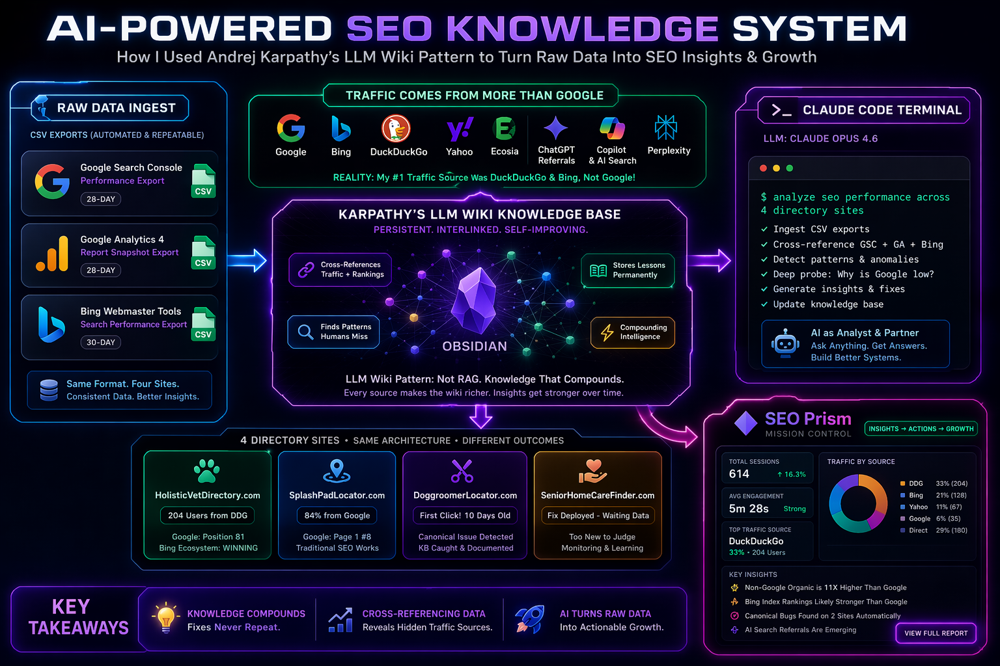
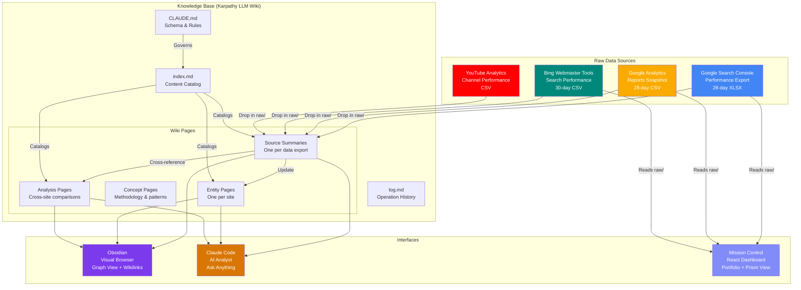

# SEO Prism

**See your search performance from every angle. Not just Google.**

SEO Prism is a methodology for cross-referencing Google Search Console, Google Analytics, and Bing Webmaster Tools data in an AI-powered knowledge base — revealing insights that no single SEO dashboard can show you.



---

## The Problem

Every SEO tool shows you Google. Only Google. But Google isn't the only search engine that matters.

When I tracked my four directory sites with SEO Prism, I discovered that **DuckDuckGo sends 5x more traffic than Google** to one of them. Same site, same content — Google ranks it on page 8, while Bing's index (which powers DuckDuckGo, Yahoo, and Ecosia) ranks it on page 1.

That insight was invisible in Google Search Console. It only became visible when I cross-referenced GSC with Google Analytics and Bing Webmaster Tools in a single, persistent knowledge base.

## How It Works

SEO Prism is built on [Andrej Karpathy's LLM Wiki pattern](https://gist.github.com/karpathy/442a6bf555914893e9891c11519de94f) — a method for having an LLM build and maintain a persistent, interlinked wiki from your raw data sources.



### Three Layers

| Layer | What It Is | Who Maintains It |
|-------|-----------|-----------------|
| **Raw Sources** | Your data exports — GSC, GA, Bing WMT, YouTube. Immutable. | You (export weekly) |
| **The Wiki** | Structured markdown pages — summaries, entity profiles, analysis, comparisons. Persistent, interlinked. | Claude (AI-maintained) |
| **The Schema** | `CLAUDE.md` — rules for how the AI operates on the wiki. How to ingest, cross-reference, and maintain consistency. | You + Claude (co-evolved) |

### Three Operations

| Operation | What Happens |
|-----------|-------------|
| **Ingest** | Drop a new export in `raw/`. Claude reads it, creates a source summary, updates entity pages, cross-references against existing data, updates the index and log. One source can touch 10+ wiki pages. |
| **Query** | Ask Claude anything. "Which site has the best CTR trend?" "Compare my Google vs Bing positions." Claude reads the wiki (not raw files) and answers with citations. |
| **Lint** | Ask Claude to health-check the wiki. Find contradictions, stale data, missing cross-references, gaps worth investigating. |

## Why It's Different

| Compared To | How SEO Prism Differs |
|------------|----------------------|
| **A prompt** | Prompts are stateless — context evaporates between sessions. SEO Prism persists. Claude has full project context on every session start. |
| **RAG** | RAG retrieves raw chunks and re-derives answers per query. SEO Prism pre-compiles synthesis at ingest time. Cross-references are already built. Insights are already surfaced. |
| **Token cost** | RAG feeds raw documents into the context window on every query. SEO Prism front-loads cost at ingest — a 930KB file becomes a 2KB summary. Weekly ingest / daily query is dramatically cheaper. |
| **SEO tools** | SEMrush, Ahrefs, Moz — they show you Google. SEO Prism cross-references Google + Bing + GA + AI search referrals in one system. |

## Quick Start (20 minutes)

### Prerequisites
- [Claude Code](https://claude.ai/claude-code) (Pro, Max, Team, or Enterprise subscription)
- [Obsidian](https://obsidian.md) (free) — optional but recommended for browsing
- Google Search Console access for your site(s)
- Google Analytics access for your site(s)
- Bing Webmaster Tools access (free — sign up at [bing.com/webmasters](https://www.bing.com/webmasters))

### Step 1: Create Your Project Folder

```bash
mkdir SEOPrism
cd SEOPrism
```

### Step 2: Launch Claude Code

```bash
claude
```

### Step 3: Give Claude the Instructions

Copy the full text of [Karpathy's LLM Wiki paper](https://gist.github.com/karpathy/442a6bf555914893e9891c11519de94f) and paste it into Claude Code. Then append this instruction at the end:

> You are now my LLM Wiki agent for SEO analysis. Implement this exact idea file as my persistent knowledge base for tracking search performance across my websites. Guide me step-by-step: create the CLAUDE.md schema file with full rules for SEO data ingestion, set up index.md and log.md, define folder conventions, and show me the first ingest example. From now on, every interaction follows the schema.

Claude will build the entire wiki structure — `CLAUDE.md`, `raw/`, `wiki/`, index, log, and overview — in one pass.

### Step 4: Export Your Data

Export from each platform and drop the files into the `raw/` folder:

| Source | How to Export | Format |
|--------|-------------|--------|
| Google Search Console | Performance → Export → Download Excel | XLSX |
| Google Analytics | Reports → Reports Snapshot → Download CSV | CSV |
| Bing Webmaster Tools | Search Performance → Export | CSV |

### Step 5: Ingest

Tell Claude:

```
Ingest the new files in raw/
```

Claude reads each file, creates source summary pages, builds entity pages for each site, cross-references the data, identifies patterns, and updates the index. One source in, multiple wiki pages created or updated.

### Step 6: Ask Anything

```
Which site has the best CTR trend?
Compare my Google vs Bing positions for "near me" queries.
What's the biggest risk to my traffic right now?
What patterns from my best site should I propagate to the others?
```

### Step 7: Browse in Obsidian

Open your project folder as an Obsidian vault. Pin `wiki/index.md`. Use the graph view to see the shape of your knowledge. Click through wikilinks to explore.

### Step 8: Repeat Weekly

Every week: export → drop in `raw/` → tell Claude to ingest → review the comparison. The knowledge compounds. Each week's analysis builds on the last.

---

## What SEO Prism Has Discovered

Real findings from tracking four directory sites with SEO Prism:

- **DuckDuckGo sends 5x more traffic than Google** to a holistic vet directory — despite Google having 90% market share
- **Same architecture, opposite traffic profiles** — one site gets 84% of organic from Google, another gets 73% from DuckDuckGo/Bing/Yahoo
- **A bot attack from Singapore** was inflating one site's analytics by 7,000 fake users — caught by cross-referencing GSC (91 real clicks) against GA (7,000 reported users)
- **A deployment failure** left one site frozen for 3 weeks — caught because the KB compared GSC data (2 impressions) against the site's 5,690 listings
- **AI search engines are sending real traffic** — ChatGPT (15 sessions), Microsoft Copilot, and Perplexity all referred users to directory sites
- **The same canonical URL bug** appeared on two different sites — caught automatically because the pattern was already documented in the KB from the first occurrence

## SEO Prism Mission Control

A local dashboard that visualizes your SEO Prism data. Built with FastAPI + React.

- **Portfolio Overview** — all sites at a glance with week-over-week changes
- **Traffic Sources** — see where users actually come from (not just Google)
- **The Prism View** — Google vs Bing positions side by side for the same queries
- **Prism Insights** — automated analyzers that surface patterns the knowledge base identifies: click potential queries, sitemap freshness, schema-HTML parity, and city page bloat
- **Project Board** — Kanban for tracking actions surfaced by the KB

*Mission Control source code is available to [Patreon supporters](https://patreon.com/ThePracticalAIShift).*

## Full Guide & Premium Content

The quick start above gets you running. For the production-grade setup:

**[Join The Practical AI Shift on Patreon](https://patreon.com/ThePracticalAIShift)** to get:
- Production `CLAUDE.md` schema (the exact rules that power SEO Prism)
- Detailed data ingestion prompts for GSC, GA, and Bing WMT
- Mission Control source code (FastAPI + React)
- Kanban board template with starter categories
- Sample data files so you can see it working immediately
- Weekly updates as the methodology evolves

## Follow the Journey

I'm documenting the entire process of building and using SEO Prism on YouTube:

**[The Practical AI Shift](https://www.youtube.com/@ThePracticalAIShift)** *(update with actual channel URL)*

- Video 1: [Adapting to the AI Wave](https://youtu.be/lZCTVPDZTjw)
- Video 2: [How I Used AI Agents to Build a Directory Site](https://youtu.be/JrfZEZrdkpo)
- Video 3: [The AI Knowledge Base That Saved My AdSense Application](https://youtu.be/P9-RdGEzeY4)
- Video 4: DuckDuckGo Sends Me 5x More Traffic Than Google
- Video 5: Introducing SEO Prism — The SEO Tool That Shows What Google Won't

## Credits

- **LLM Wiki pattern** by [Andrej Karpathy](https://gist.github.com/karpathy/442a6bf555914893e9891c11519de94f)
- **Built with** [Claude Code](https://claude.ai/claude-code) by Anthropic
- **Visualization** with [Obsidian](https://obsidian.md)

## License

MIT License — see [LICENSE](LICENSE) for details.
