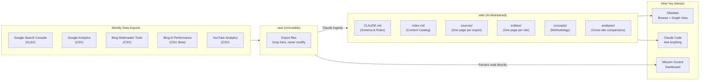
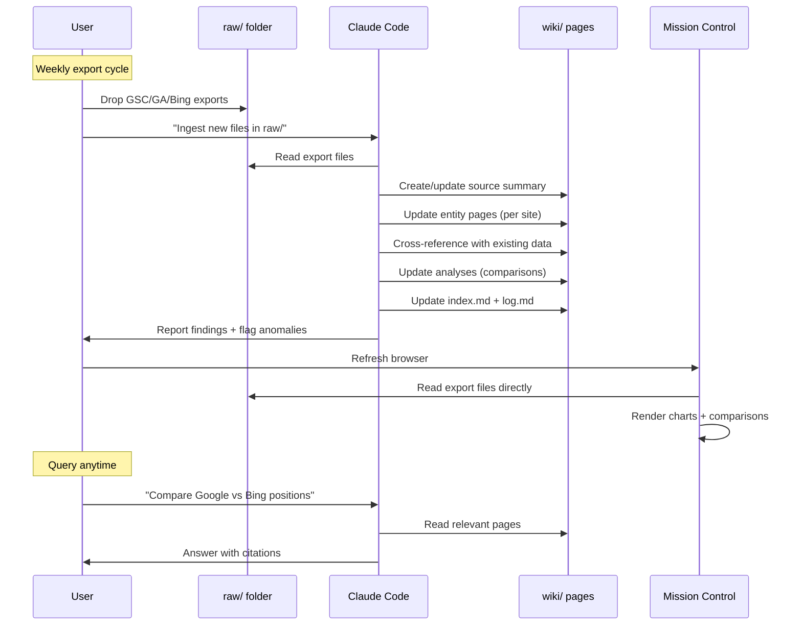
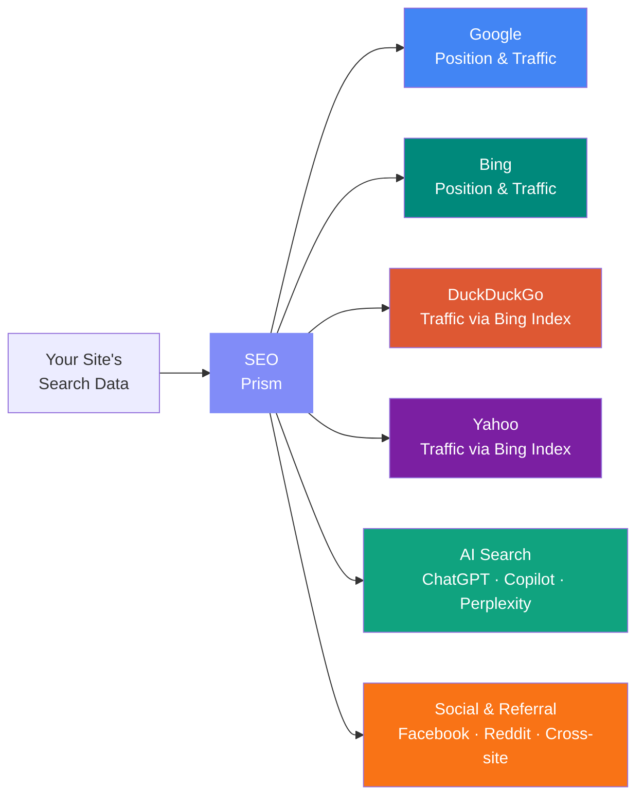

# SEO Prism Architecture

## System Overview



## Data Flow



## Folder Structure

```
your-project/
├── CLAUDE.md                    # Schema — rules for the AI
├── raw/                         # Immutable source data
│   ├── *-Performance-*.xlsx     # GSC exports
│   ├── Reports_snapshot*.csv    # GA exports
│   ├── bing_*_performance_*.csv # Bing exports
│   └── bing_*_ai_performance_*.csv
├── wiki/                        # AI-maintained wiki
│   ├── index.md                 # Content catalog
│   ├── log.md                   # Operation history
│   ├── overview.md              # High-level synthesis
│   ├── sources/                 # One page per data export
│   ├── entities/                # One page per site
│   ├── concepts/                # Methodology pages
│   └── analyses/                # Cross-site comparisons
└── mission-control/             # Optional dashboard
    ├── backend/                 # FastAPI (Python)
    │   ├── main.py
    │   ├── parsers/
    │   │   ├── gsc_parser.py
    │   │   ├── ga_parser.py
    │   │   └── bing_parser.py
    │   └── data/
    │       └── projects.json    # Kanban state
    └── frontend/                # React + Vite
        └── src/
            └── pages/
                ├── Portfolio.jsx
                ├── TrafficSources.jsx
                ├── PrismView.jsx
                ├── SiteDetail.jsx
                └── Projects.jsx
```

## The Prism Metaphor

Like a prism splits white light into a spectrum of colors, SEO Prism splits your site's search data into its component sources — revealing the full picture that no single tool shows.



## Key Design Decisions

| Decision | Rationale |
|----------|-----------|
| **Markdown, not a database** | Human-readable, version-controlled, portable. Works with Obsidian. No setup. |
| **AI maintains the wiki** | Humans are bad at cross-referencing and bookkeeping. LLMs don't get bored or forget to update a page. |
| **Raw data is immutable** | Source of truth never changes. The wiki interprets; it doesn't alter. |
| **Ingest-time synthesis** | Cross-references are built when data arrives, not re-derived on every query. Cheaper and more reliable than RAG. |
| **Local-first** | No cloud services, no API keys for the KB itself, no subscription beyond Claude Code. Your data stays on your machine. |
| **Dashboard reads raw/** | Mission Control doesn't duplicate data. It reads the same files the KB uses. One source of truth. |
