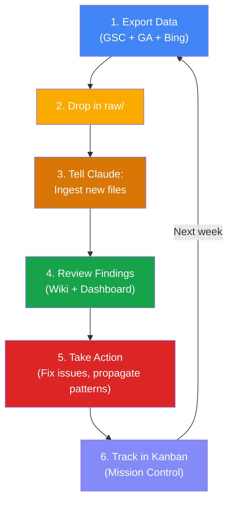

# Weekly Workflow

A repeatable cycle for maintaining your SEO Prism knowledge base.



## Every Week (Sunday or Monday)

### 1. Export (10 minutes)

For each site:

- [ ] Google Search Console → Performance → Last 28 days → Export XLSX
- [ ] Google Analytics → Reports Snapshot → Download CSV
- [ ] Bing Webmaster Tools → Search Performance → Export CSV
- [ ] Bing AI Performance → Download (if available)

### 2. Drop (1 minute)

Move all files to your project's `raw/` folder.

### 3. Ingest (5 minutes)

Open Claude Code in your project directory:

```
Ingest all new files in raw/
```

Wait for Claude to process. It will:
- Create source summaries
- Compare against last week
- Update entity pages
- Flag changes and anomalies

### 4. Review (10 minutes)

Read Claude's findings. Check:
- What moved? What didn't?
- Any new queries appearing?
- Any traffic source changes?
- Any issues flagged?

If using Mission Control, refresh the dashboard.

### 5. Act (varies)

Based on findings:
- Fix technical issues (redirects, noindex, sitemap)
- Propagate patterns from your best site to others
- Investigate anomalies (bot traffic, ranking drops)
- Update content on underperforming pages

### 6. Track (2 minutes)

Add actions to your Kanban board. Move completed items to Done.

---

**Total time: ~30 minutes per week.** The knowledge compounds automatically. Each week's analysis builds on every previous week.

## Monthly: Lint

Once a month, ask Claude:

```
Lint the wiki. Check for contradictions, stale claims, orphan pages, 
missing cross-references, and data gaps worth investigating.
```

This keeps the wiki healthy as it grows.
